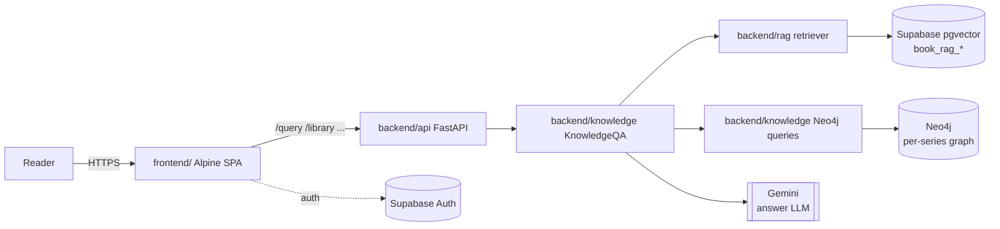
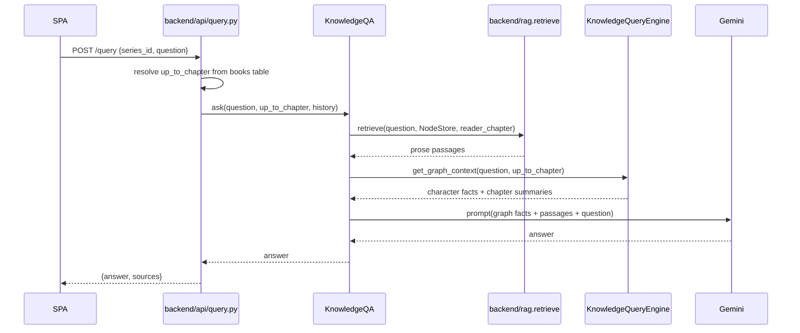
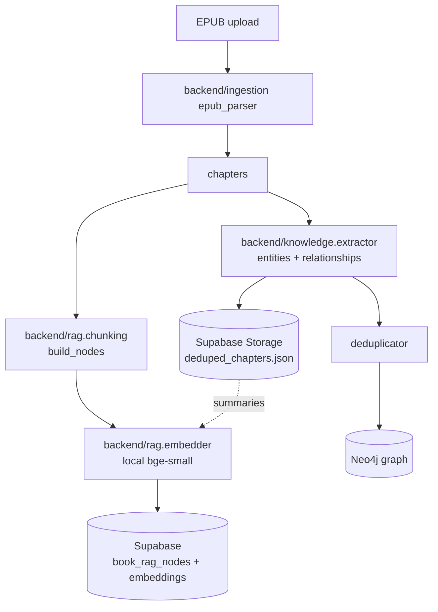

# BookLens

A spoiler-safe reading companion for book series. Upload an EPUB, track your chapter, and chat with an AI that only knows what you've already read — powered by a per-series knowledge graph and hierarchical RAG retrieval.

## Quick start

```bash
# 1. Install deps
poetry install

# 2. Configure secrets
cp .env.example .env   # then fill in keys

# 3. Start Neo4j (local dev)
docker compose -f docker/docker-compose.neo4j.yml up -d

# 4. Run the server
poetry run uvicorn backend.main:app --reload
# → http://localhost:8000
```

See [docs/SETUP.md](docs/SETUP.md) for full setup including Supabase and Neo4j.

## Repo layout

```
book-lens/
├── backend/            # FastAPI backend (Python)
│   ├── api/            # HTTP routers (library, books, query)
│   ├── knowledge/      # KG queries, QA orchestrator, entity extractor
│   ├── rag/            # Hierarchical chunking + pgvector retrieval
│   ├── ingestion/      # EPUB parsing
│   ├── library/        # Series/book CRUD
│   ├── llm/            # Gemini client wrapper
│   ├── config/         # Settings (pydantic-settings)
│   └── main.py         # App entry point
├── frontend/           # Alpine.js SPA (served as static by FastAPI)
│   └── index.html
├── db/                 # Supabase migrations
│   └── migrations/
├── docker/             # Dockerfile + docker-compose for Neo4j
├── scripts/            # Dev-only ingestion & backfill scripts
│   └── README.md       # What each script does
├── docs/               # Architecture docs, setup guides, archived notebooks
│   └── notebooks/      # Exploration notebooks (not maintained)
├── tests/
├── local/              # Machine-local only — gitignored
│   ├── uploads/        # EPUB files
│   └── data/           # Extraction outputs
└── memory/             # Project memory docs for Claude
```

## Module map

| Module | Responsibility | Key entry points |
|--------|---------------|-----------------|
| `backend/api/query.py` | POST `/query` — chat endpoint | `query_knowledge_graph()` |
| `backend/knowledge/qa.py` | Orchestrate retrieval + Gemini generation | `KnowledgeQA.ask()` |
| `backend/knowledge/retriever.py` | Route to graph / vector / hybrid | `Retriever.retrieve()` |
| `backend/rag/` | Hierarchical chunking + pgvector search | `ingest_book()`, `retrieve()` |
| `backend/rag/node_store.py` | Supabase I/O for RAG nodes | `NodeStore` |
| `backend/knowledge/query.py` | Neo4j KG queries (characters, facts) | `KnowledgeQueryEngine` |
| `backend/knowledge/extraction_service.py` | EPUB → entities → Neo4j pipeline | `ExtractionService.extract()` |
| `backend/ingestion/epub_parser.py` | Parse EPUB into chapters | `parse_epub()` |
| `backend/library/manager.py` | Series/book library state | `get_series_by_id()` |
| `frontend/index.html` | Alpine.js SPA | served at `/` |
| `db/migrations/` | Supabase SQL migrations | run via Supabase CLI |

## Architecture

### High-level system



### Chat request flow



### Book ingestion flow



## Data stores

| Store | What lives there | Key env vars |
|-------|-----------------|--------------|
| Supabase Postgres | Auth, library (books/series), RAG nodes (`book_rag_*`), legacy chunks (`book_chunks`) | `SUPABASE_URL`, `SUPABASE_KEY` |
| Supabase Storage | Extracted chapter gold layer (`extractions/.../deduped_chapters.json`), book covers | same |
| Neo4j | Per-series knowledge graph: characters, relationships, world facts, chapter summaries | `NEO4J_URI`, `NEO4J_USERNAME`, `NEO4J_PASSWORD` |

## External services

| Service | Used for |
|---------|---------|
| **Gemini** (`google-genai`) | All answer generation in the app |
| **Anthropic Claude Haiku** | Chapter summary fallback when no gold layer exists (ingestion only) |
| **HuggingFace sentence-transformers** | Local embeddings — `BAAI/bge-small-en-v1.5` for prose chunks, `all-MiniLM-L6-v2` for KG character embeddings |

## Common tasks

| Task | Command |
|------|---------|
| Ingest a book (KG pipeline) | `poetry run python scripts/run_pipeline.py --epub local/uploads/... --series <slug>` |
| Ingest a book (RAG vector index) | `poetry run python scripts/run_rag_ingest.py --epub ... --series ... --book-id ... --user-id ...` |
| Re-seed dev Neo4j | `NEO4J_ENV=dev poetry run python scripts/run_kg_ingest.py --series ... --book-id ... --user-id ...` |
| Ask a question (CLI) | `poetry run python scripts/ask.py --series ... --question "..."` |
| Format / lint / type-check | `poetry run black backend/ && poetry run ruff check backend/ && poetry run mypy backend/` |
| Deploy to HF Spaces | See [docs/deployment.md](docs/deployment.md) — push to the deploy repo, Spaces rebuilds from `docker/Dockerfile` |

## Further reading

- [docs/SETUP.md](docs/SETUP.md) — full local setup (env vars, Neo4j, Supabase schema)
- [docs/KNOWLEDGE-QA.md](docs/KNOWLEDGE-QA.md) — how the Q&A pipeline works
- [docs/KNOWLEDGE-GRAPH-SETUP.md](docs/KNOWLEDGE-GRAPH-SETUP.md) — Neo4j schema and entity model
- [docs/MODEL-CONFIG.md](docs/MODEL-CONFIG.md) — how to swap models
- [scripts/README.md](scripts/README.md) — what each script does and when to run it
