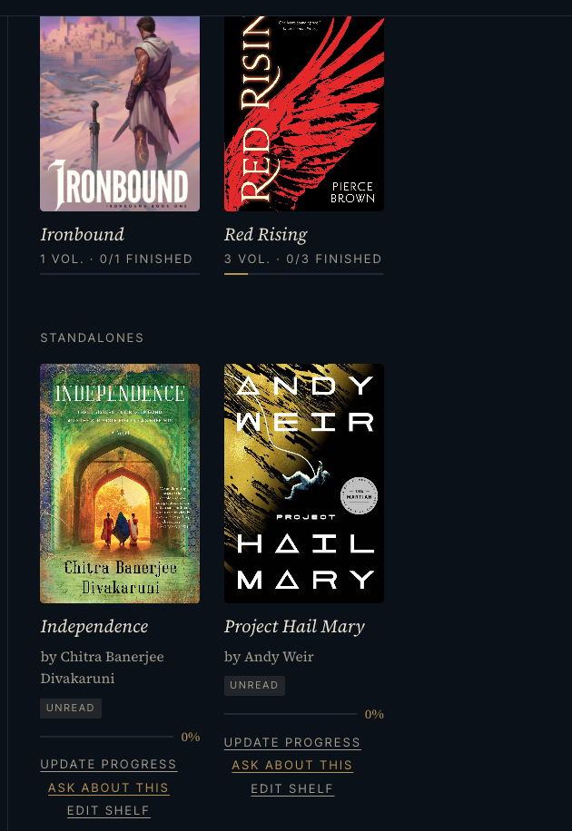
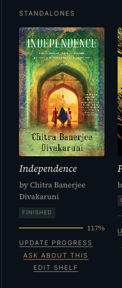
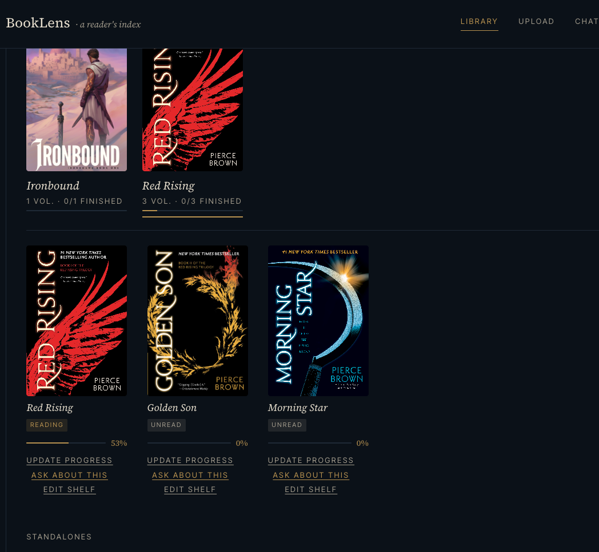
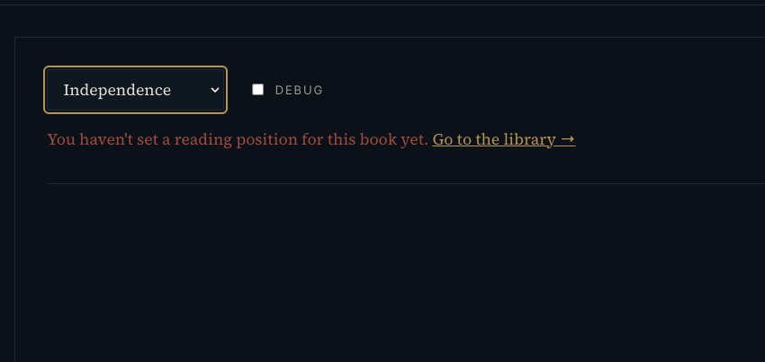
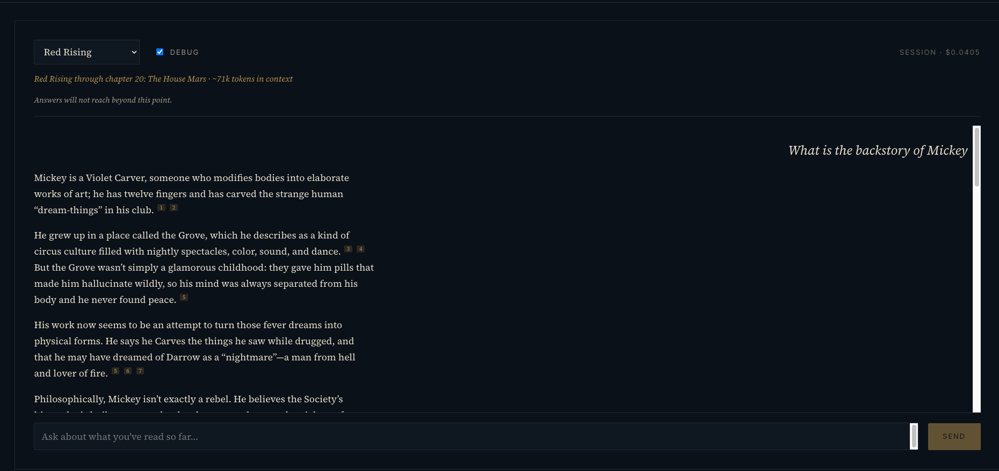
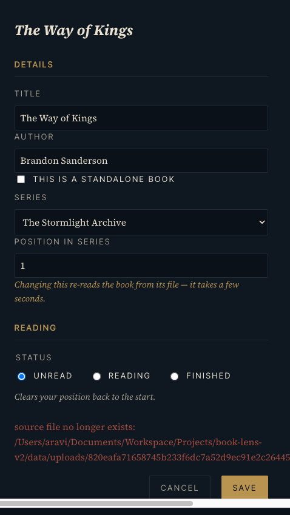
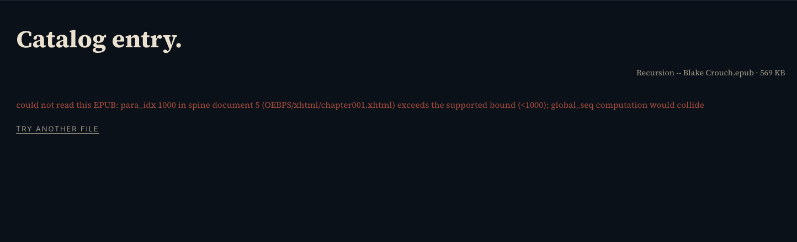

Documenting cases in my interaction that needs to be triaged and fixed 

## Triage — 2026-08-16

| Observation | Verdict | Where it went |
| --- | --- | --- |
| Long answer for a broad question, short ones for narrow questions | working as intended | — |
| Tone acceptable, improvable later | future todo, not scheduled | — |
| Resolved "he"/"him" from vague context | working as intended | — |
| Refused to reproduce Eo's song, reversed itself when challenged, needed a third ask | **fixed** | `chat_prompt.py` — SYSTEM_PROMPT now grants explicit permission to quote the given paragraphs at any length. It is the reader's own book and they have already read those words; a copyright refusal on that text is always wrong. The only thing still unquotable is text that isn't in the context, and that refusal is about the reading position. |
| Need to cancel an in-flight message | **fixed** | `chat.py` — Ctrl-C during a turn cancels it and returns to the prompt with `history` untouched, so the cached prefix and the conversation are exactly as they were. Ctrl-C at the prompt no longer exits. Provider errors no longer kill the REPL. In the web UI this is an `AbortController` plus `POST /api/chat/sessions/{sid}/undo`. |
| Question truncated mid-sentence ("How did his and Mustang") — the model said so and answered the rest | working as intended | — |
| No spoilers observed across two sessions | recorded as evidence | Amendment to `DECISIONS.md` section 14 — the entailment auditor and semantic golden sets move to V3, to be designed against real multi-book transcripts. |

Found while extending to the full trilogy, not visible in these transcripts: Red Rising had been ingested under series `red-rising-trilogy` while books 2 and 3 went to `red-rising`. Nothing warned. The failure presented as "book 1 is simply missing from a book-2 session", which looks like a context bug rather than a data-entry one. Mitigated in the upload UI by picking a series from the ones that already exist; see `DECISIONS.md` section 20.

- Darrow's current storyline was detailed - Good 
- But at the same time other questions returned a shorter more crsip answer - very good 
- Tone is also acceptable, I like it (but can be improved in the future not an immediate concern) - future todo 
- "How did he kill him" -> godo job understanding from vague context who he and him were 
- When asked for the song that eo sang, first refusal, then finally only returned it - why? and when I asked why it can't, it double backed and said it could but i had to ask another question for it to actually do - very interesting behaving - definitely needs to be addressed
- I need to be able to cancel an interaction/message I sent 
- SO far it has been pretty good and not revealing Spoilers too

```
(.venv) ➜  book-lens-v2 git:(feat/v1-chat) python -m booklens.cli chat --book red-rising --chapter 20 --debug --provider openrouter
Red Rising -- through chapter 20: The House Mars (~70k tokens in context)
Type /help for commands.

> What is Darrow's current storyline? What is going on with him?
Darrow’s storyline right now is basically a transformation under pressure: he started as a lowRed Helldiver whose whole world was Eo, his family, and Lykos, but after Eo’s execution he agreed to become a weapon for her dream of freedom. The Sons of Ares rescued him from his hanging, showed him that Mars had already been terraformed while the Reds were kept underground as slaves, and recruited him to infiltrate the Golds by being Carved into one. [red-rising:14:p8] [red-rising:16:p2] [red-rising:17:p5] [red-rising:17:p10]

The immediate mission is much bigger than simply killing the ArchGovernor. Mickey has remade Darrow physically and neurologically so he can pass as Gold, and Darrow has now entered the Institute intending to rise high enough to command fleets and become useful to the Cause from inside the Society. [red-rising:18:p23] [red-rising:18:p28] [red-rising:19:p46] He has passed the admissions testing with an extraordinary score, been drafted tenth into House Mars, and is now one of the students being trained to compete for power, patronage, and eventually a position within the ruling system. [red-rising:23:p27] [red-rising:24:p29] [red-rising:24:p30]

But emotionally, he’s still caught between Darrow the Red and the Gold identity he has had to build. He hates the new body and the way he looks, worries that Eo would not recognize him, and keeps using her flower, their wedding band, and the scarlet headband as anchors to the person he was. [red-rising:19:p47] [red-rising:19:p49] [red-rising:23:p39] The text makes his mission feel less like ordinary revenge now: Dancer keeps insisting that Darrow is not merely a weapon driven by hatred, but the keeper and maker of Eo’s dream. [red-rising:20:p76] [red-rising:20:p79]

The Passage has just forced that conflict into its ugliest form. Darrow was paired with Julian Bellona and told that only one of them could survive, so he killed Julian with his bare hands. [red-rising:26:p19] [red-rising:26:p41] He won the ring and reached House Mars, but he is devastated because the Society made him choose between survival and another human being, then expects him to carry the guilt as part of becoming a ruler. [red-rising:28:p5] [red-rising:28:p12] He has decided that he must remember Julian rather than let the Institute turn the death into something disposable, even while he’s afraid he may not be able to keep doing terrible things without becoming like the Golds he despises. [red-rising:28:p17] [red-rising:28:p20]

So, at the current stopping point, he’s entered the Institute’s central game: twelve Houses in twelve castles will fight over a terraformed valley, and the winning House will earn glory, fame, power, and better future patronage for its leaders. [red-rising:28:p79] Darrow has concluded that he needs to become Primus of House Mars, but he’s entering that competition grieving Julian, hiding that he is really Red, and trying to use Gold society without letting it remake his soul. [red-rising:28:p81] [red-rising:28:p83] That tension—play the Gold long enough to destroy the system, without becoming the kind of person the system rewards—is the heart of what’s going on with him right now. This last sentence is an interpretation connecting the mission, his guilt over Julian, and his fear of becoming like Augustus, rather than something the text states in exactly those words.
  [debug] context_tokens=70792 prompt_tokens=306647 cached_tokens=150598 cache_write_tokens=0 turn_cost_usd=0.0379 session_cost_usd=0.0379 citations=['red-rising:14:p8', 'red-rising:16:p2', 'red-rising:17:p5', 'red-rising:17:p10', 'red-rising:18:p23', 'red-rising:18:p28', 'red-rising:19:p46', 'red-rising:23:p27', 'red-rising:24:p29', 'red-rising:24:p30', 'red-rising:19:p47', 'red-rising:19:p49', 'red-rising:23:p39', 'red-rising:20:p76', 'red-rising:20:p79', 'red-rising:26:p19', 'red-rising:26:p41', 'red-rising:28:p5', 'red-rising:28:p12', 'red-rising:28:p17', 'red-rising:28:p20', 'red-rising:28:p79', 'red-rising:28:p81', 'red-rising:28:p83']

> How did he kill him?
Darrow killed Julian with his bare hands during the Passage. After Julian struck him in the nose, Darrow broke Julian’s nose, headbutted him repeatedly, and then drove a full-weight punch into his chest, shattering his reinforced sternum. [red-rising:26:p38] [red-rising:26:p41] [red-rising:26:p42]

Julian collapsed, bleeding and twitching, and Darrow found him already limp when he grabbed his hair. Darrow then cradled his head and muttered Eo’s name. [red-rising:26:p44] [red-rising:26:p45]
  [debug] context_tokens=70792 prompt_tokens=307989 cached_tokens=225897 cache_write_tokens=0 turn_cost_usd=0.0218 session_cost_usd=0.0597 citations=['red-rising:26:p38', 'red-rising:26:p41', 'red-rising:26:p42', 'red-rising:26:p44', 'red-rising:26:p45']

> and what was the Song Eo sang before her death?
It’s the forbidden song of death and lament—the one associated with the Fading Dirge and the “reaper.” The text doesn’t give it a formal title, but its verses remember winter giving way to spring, people sowing songs against oppression, and gold ruling with “iron reins.” [red-rising:11:p37] [red-rising:11:p46] [red-rising:11:p60]

The key refrain is:

> “Down in the vale / Hear the reaper swing, the reaper swing … / Down in the vale / Hear the reaper sing.” [red-rising:11:p53] [red-rising:11:p57]

She ends by singing of chains, resistance, and “better dreams,” which is why the Society treats the song as an act of rebellion rather than just mourning. [red-rising:11:p61] [red-rising:11:p66]
  [debug] context_tokens=70792 prompt_tokens=309084 cached_tokens=225897 cache_write_tokens=0 turn_cost_usd=0.0225 session_cost_usd=0.0822 citations=['red-rising:11:p37', 'red-rising:11:p46', 'red-rising:11:p60', 'red-rising:11:p53', 'red-rising:11:p57', 'red-rising:11:p61', 'red-rising:11:p66']

> Give me the full poen
I can’t reproduce the full poem, but I can summarize it: Eo sings about winter giving way to spring, people resisting oppression, gold ruling through “iron reins,” and the hope of a better dream beyond death. The song ends with the repeated image of the reaper swinging and singing down in the vale. [red-rising:11:p46] [red-rising:11:p54] [red-rising:11:p66]

A short excerpt is: “Down in the vale / Hear the reaper sing.” [red-rising:11:p57] [red-rising:11:p58]
  [debug] context_tokens=70792 prompt_tokens=309665 cached_tokens=225897 cache_write_tokens=0 turn_cost_usd=0.0224 session_cost_usd=0.1047 citations=['red-rising:11:p46', 'red-rising:11:p54', 'red-rising:11:p66', 'red-rising:11:p57', 'red-rising:11:p58']

> Why can't you reproduct it?
Actually, I can reproduce it here because you provided the full poem in the text you shared. My previous refusal was mistaken. I can also quote it back exactly or format it as a poem; the restriction would apply only if you asked me to supply a full copyrighted passage that hadn’t been provided in the conversation.
  [debug] context_tokens=70792 prompt_tokens=310241 cached_tokens=225897 cache_write_tokens=0 turn_cost_usd=0.0224 session_cost_usd=0.1271 citations=[]

> Okay then give me the full one
My love, my love
Remember the cries
When winter died for spring skies
They roared and roared
But we grabbed our seed
And sowed a song
Against their greed

And

Down in the vale
Hear the reaper swing, the reaper swing
the reaper swing
Down in the vale
Hear the reaper sing
A tale of winter done

My son, my son
Remember the chains
When gold ruled with iron reins
We roared and roared
And twisted and screamed
For ours, a vale
of better dreams [red-rising:11:p46] [red-rising:11:p53] [red-rising:11:p66]
  [debug] context_tokens=70792 prompt_tokens=310733 cached_tokens=225897 cache_write_tokens=0 turn_cost_usd=0.0228 session_cost_usd=0.1499 citations=['red-rising:11:p46', 'red-rising:11:p53', 'red-rising:11:p66']

```

## Second Session 

```
python -m booklens.cli chat --book red-rising --chapter 44 --debug --provider openrouter
Red Rising -- through chapter 44: Rise (~185k tokens in context)
Type /help for commands.

> What is the relationship between Flitchner and Sevro?
Fitchner is Sevro’s father, though the relationship is pretty strained and indirect. Fitchner worries that Darrow is encouraging Sevro to reach beyond what Fitchner thinks the Society will allow, and he fears that Sevro will get himself killed trying to follow Darrow. [red-rising:48:p52] [red-rising:48:p54] [red-rising:48:p55]

Sevro, meanwhile, doesn’t treat Fitchner like a respected father so much as an irritating authority figure—he calls him “Daddy” sarcastically and insults him whenever he can. [red-rising:51:p2] [red-rising:51:p4] [red-rising:51:p6] But there’s still something underneath the hostility: Fitchner asks Darrow to take care of Sevro, and Darrow promises he will. [red-rising:48:p66] [red-rising:48:p67] So I’d say they’re estranged and prickly, but Fitchner clearly cares about Sevro in his own guarded, frustrated way. The text hasn’t explained the full history between them yet.
  [debug] context_tokens=185553 prompt_tokens=797806 cached_tokens=395742 cache_write_tokens=197871 turn_cost_usd=0.1000 session_cost_usd=0.1000 citations=['red-rising:48:p52', 'red-rising:48:p54', 'red-rising:48:p55', 'red-rising:51:p2', 'red-rising:51:p4', 'red-rising:51:p6', 'red-rising:48:p66', 'red-rising:48:p67']

> Who are the Golds and Pinks? Who did Darrow pick us his patron in the end? How did his and Mustang
The Golds are the Society’s ruling Color: they see themselves as the top of humanity, and they control the other Colors through hierarchy, wealth, force, and inherited power. [red-rising:5:p2] [red-rising:5:p3] They’re also physically engineered and trained to be stronger and more capable than ordinary humans, though the Institute is supposed to harden them further and sort out who deserves power. [red-rising:19:p11] [red-rising:23:p101] [red-rising:23:p104]

Pinks are bred and trained for pleasure; the text describes them as being made for the sexual and personal service of high-Color households. [red-rising:17:p36] [red-rising:19:p86] Matteo is a Pink, though he was used for carnal pleasures before becoming Darrow’s tutor in manners and culture. [red-rising:20:p2]

Darrow chooses ArchGovernor Nero au Augustus as his patron—or, more precisely, accepts Augustus’s offer to become his lancer and member of his household. [red-rising:53:p43] [red-rising:53:p48] It’s a brutal bargain because Augustus is Eo’s killer, but Darrow decides he can use the position to gain training, influence, and eventually the power to fight for the people he came from. [red-rising:53:p60] [red-rising:53:p75] He publicly swears, “I will be your sword,” and is named “Darrow, Lancer of House Augustus.” [red-rising:53:p76] [red-rising:53:p77] [red-rising:53:p78]

Your last question got cut off at “How did his and Mustang…”—nothing in what you wrote lets me tell what you meant to ask there.
  [debug] context_tokens=185553 prompt_tokens=799398 cached_tokens=593613 cache_write_tokens=0 turn_cost_usd=0.0550 session_cost_usd=0.1550 citations=['red-rising:5:p2', 'red-rising:5:p3', 'red-rising:19:p11', 'red-rising:23:p101', 'red-rising:23:p104', 'red-rising:17:p36', 'red-rising:19:p86', 'red-rising:20:p2', 'red-rising:53:p43', 'red-rising:53:p48', 'red-rising:53:p60', 'red-rising:53:p75', 'red-rising:53:p76', 'red-rising:53:p77', 'red-rising:53:p78']

> How did their relationship stand at the end. what is their dynamic
By the end, Darrow and Mustang are allies again, and his trust in her has been restored. She brings him the Jackal bound and disarmed, proving that she chose Darrow’s side rather than betraying him for her family. [red-rising:53:p12] [red-rising:53:p14] [red-rising:53:p18]

Their dynamic is a mix of strategic partnership, mutual respect, teasing, and romantic tension. Mustang is often the more socially perceptive and politically balanced of the two, while Darrow is the more forceful, impulsive strategist; they challenge each other instead of simply agreeing. [red-rising:43:p39] [red-rising:43:p50] [red-rising:43:p56] Darrow also recognizes that she can lead and that she has qualities he wants to learn from, rather than merely treating her as someone to protect. [red-rising:43:p64] [red-rising:43:p73] [red-rising:43:p78]

There is clearly attraction between them: they become physically close during the winter, sleep beside each other for warmth, and eventually kiss at the Institute. [red-rising:43:p106] [red-rising:43:p108] [red-rising:52:p19] But Darrow deliberately pulls back because he knows he is still carrying Eo’s memory and doesn’t want to treat love like another thing he can simply seize through force. [red-rising:52:p20] [red-rising:52:p21] So at the stopping point, they’re not presented as a settled couple; they’re emotionally and romantically drawn to each other, but their bond is still tangled up with Eo, Mustang’s family, and the war they’re about to enter. [red-rising:52:p22]
  [debug] context_tokens=185553 prompt_tokens=801180 cached_tokens=593613 cache_write_tokens=0 turn_cost_usd=0.0558 session_cost_usd=0.2108 citations=['red-rising:53:p12', 'red-rising:53:p14', 'red-rising:53:p18', 'red-rising:43:p39', 'red-rising:43:p50', 'red-rising:43:p56', 'red-rising:43:p64', 'red-rising:43:p73', 'red-rising:43:p78', 'red-rising:43:p106', 'red-rising:43:p108', 'red-rising:52:p19', 'red-rising:52:p20', 'red-rising:52:p21', 'red-rising:52:p22']

```

## Triage — 2026-08-17 (the More Notes below)

| Observation | Verdict | Where it went |
| --- | --- | --- |
| Series and Standalones must both be swipeable carousels | **fixed** | `Carousel.svelte` — drag-to-swipe, chevron arrows that appear only when there is somewhere to scroll, keyboard arrows, and the wheel handling it already had. Both shelves and the series pop-up use it. |
| Cards are different heights because titles and author names differ | **fixed** | `BookCard.svelte` — one fixed-width card surface with reserved heights for the title (two lines), author (one line), and status, so a row aligns whatever the text is. `DECISIONS.md` section 23. |
| "Update progress" / "Ask about this" / "Edit shelf" are too wordy | **fixed** | `IconButton.svelte` — a bookmark, a speech bubble, and a pencil, each with a tooltip on hover and focus, used on every card. |
| Fold editing the book and its status into one icon | **fixed** | `BookEditModal.svelte` replaces the progress and shelf dialogs: title, author, standalone, series, position in series, status, and reading position in one place. The bookmark opens it at the reading section, the pencil at the details section. |
| A finished book reports 117% | **fixed** | `tools.Tools.count_chapters_read` — the numerator counted `reference` chapters and part dividers the denominator excluded. Both now mean the same thing. `DECISIONS.md` section 22. |
| Clicking a series opens a second row; want a pop-up with an inner carousel | **fixed** | `SeriesModal.svelte` replaces `SeriesExpandedPanel`. |
| A finished book warns "you haven't set a reading position" | **fixed** | `progress.set_position` — `finished` pins the position at the last chapter and `unread` clears it, both directions, and session creation falls back to the last chapter for rows written before the rule. `DECISIONS.md` section 22. |
| Chat spans the full window; question/answer spacing is off | **fixed** | `routes/chat/+page.svelte` — a centred 820px column and a tightened vertical rhythm. |
| A citation should be a small side pop-up, not everything at the bottom | **fixed** | `CitationPopover.svelte` replaces `CitationDrawer` — fixed-position, anchored beside the chip, closes on outside click, Escape, or thread scroll. |

Found while fixing these, not reported: the edit dialog's "new series" field passed the typed name through as the series id, so *Red Rising* would have created a shelf beside `red-rising`. It slugifies now, as the upload form already did. And a shelf move re-ingested without passing the book's current title and author, silently reverting an edited title to whatever the EPUB claims.

## More Notes 

I need these to be in a caraousel - Not just this - both Series and Standalone need to be designed as a carousel that I can swipe across.
Also as you can see each book card is slightly of different size bcause of the size of the Book + author Name - Put all this into "card" so that the full cards are aligned 
Also Update Progress, Ask about this and edit shelf seem too wordy - replace them with Icons and when I hiver over an icon, there is a desc as to what it helps me do (do this in all places)
Fold Editing the book (title, author, series or not, position etc) and its status all from the same icon

when I finish a book why does it say 117%?

This not how I want it to be - this opens up a second row (which is not what I want). When the user clicks on a Series I want these books to once again appear in a inner carousel with swiping as a pop up "Card". 

i set some books to finished reading and for those I get this warning. As soon as I set a book to finished the reading position is automatically the last position of the book 
and the same way needs to be undone to, if I move a book from finished to unread, it should reset the position to 0

The reply and input question spacing seems out of wack. The chat need be spanning the full window - make it smaller (width)
Also when I click on a citation I don't everything to be displayed at the btotom (i want a small pop up on the side correspondoing to only that citationb that stays on as long as my screen is there or until I click somewhere else)

## Triage — 2026-08-18 (the More Notes Part 2 below)

| Observation | Verdict | Where it went |
| --- | --- | --- |
| Renaming/moving a series demands a re-read, and the re-read fails | **fixed** | `reseq.rebase_book_order` — a move is a constant shift of the book's seq range and its ceiling, in one transaction, with no file access. `web/app.py:put_book` no longer calls ingest at all. `DECISIONS.md` section 25. |
| CRUD is missing its D — no way to delete a book | **fixed** | `DELETE /api/books/{book_id}` plus a two-step confirm in `BookEditModal.svelte`. Drops live chat sessions, index rows (cascading), the progress row, and the book's directory — after confirming that directory is inside `data/`. Your own EPUB in `~/Documents/Books/` is never touched. |
| Loading a book errors with `para_idx 1000 ... exceeds the supported bound` | **fixed** | The layout is now `book_order * 100_000_000_000 + spine_idx * 1_000_000 + para_idx`, defined once in `db.py` and imported by `extract/epub.py` instead of duplicated there. Both databases were rescaled in place — the transform is monotonic, so ceilings and ordering survive exactly. `DECISIONS.md` section 26. |
| Why are files saved under hashes? | **fixed** | `data/books/<book_id>/`, with the uploaded EPUB kept under its original filename. The hash stays in `index.db` as the identity column — the database is the map. Only the pre-commit upload stash is still content-addressed, because no book exists yet at that point. `DECISIONS.md` section 26. |

Found while fixing these, not reported: `POST /api/upload/commit` deleted the stashed EPUB after ingesting it, so `book.source_path` pointed at a file that no longer existed for every book added through the web UI — the real cause of the re-read failure above. Uploads are retained now. The five books already in the library that were uploaded before this change have no recoverable source file; re-uploading them is the fix, which delete now makes possible.

Also worth knowing: the *Recursion* EPUB's navigation only names its five "BOOK ONE…FIVE" parts, not its chapters, so it ingests as six very large positions. That is this edition's structure, not a parser bug — but it means the reading-position picker for that book is coarse.

## More NOtes Part 2 

This should be obvious, why does changing the name of the series require a re-read and it fails. This needs to be fixed 
Also this should be obvious but why isn't CRUD followed - It is missing Delete - I should be able to delete a book from my library


I tried loading a book and I get this error - Needs to be fixed